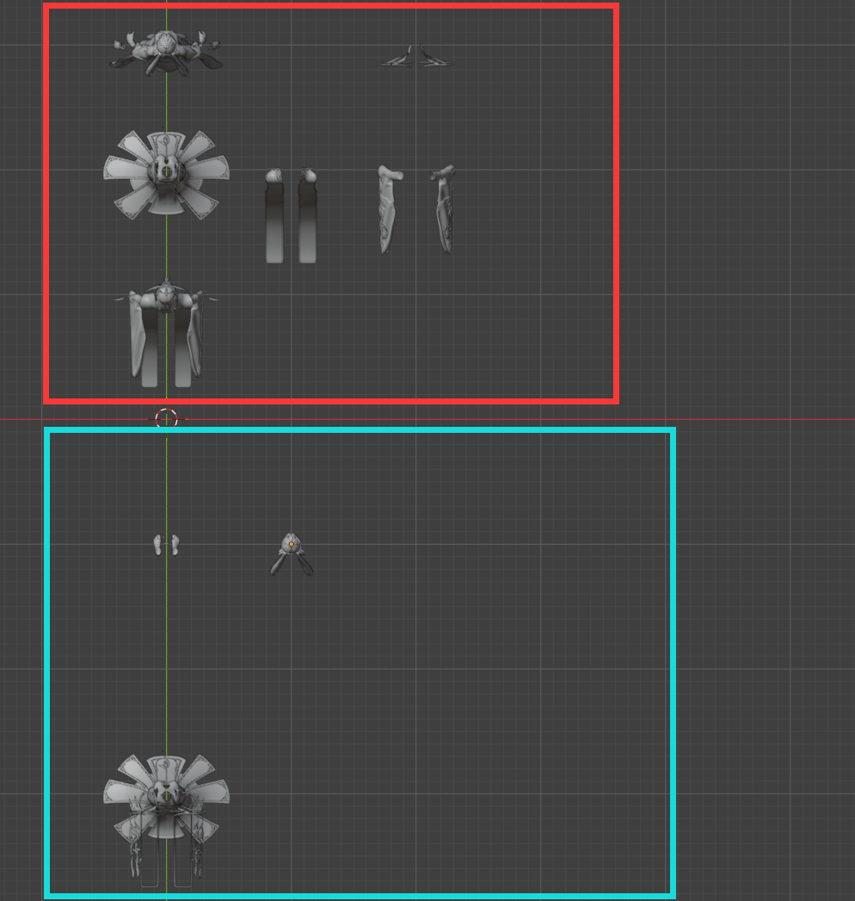

# MoreNifInput

## 1. 插件作用

MoreNifInput 用于把大量 mod 中的 NIF 文件批量导入 Blender，并在同一个 Blender 窗口中按模组和模型层级进行整理，便于快速预览大量 mod 的模型关系。

插件提供若干清理设置，用来处理批量导入时常见的网格重叠和无效网格问题。这些处理大多采用删除方式，因为本插件的主要目标是预览而非编辑保留。

最终效果是尽量以无重叠、按组组合的形式呈现库中的模组和模型。由于部分 mod 的目录结构差异较大，少数情况下效果可能不理想。

## 2. 开发环境

- Blender 5.1.2
- Windows 10 64 位

插件未在其他环境中测试，可能出现未知问题。

## 3. 用户操作流程

1. 填入需要处理的 NIF 库路径。
2. 选择输出模式并点击“检测数量”。
   - “按 mod 文件层输出”：每个 mod 顶层文件夹作为一个 NIF 组。
   - “最小文件层输出”：按 meshes 下每个直接包含 NIF 的目录分别成组，并使用嵌套集合。
3. 确认导入设置和网格布局。

红框表示主部件，蓝框表示拆分出来的次级部件。

4. 点击“开始导入”。

**NIF 数量过多时，导入时间可能会非常漫长。**

5.某些nif文件可能无法导入，此时该mod内的nif都会被取消导入，并使用一个立方体网格体来提示错误

## 4. 查找模型对应的文件位置

在 Blender 中选中目标模型后，大纲视图中的集合层级和集合名即对应其文件路径。

## 5. 贡献者

[https://github.com/FrozenTumbleweed](https://github.com/FrozenTumbleweed)

## 6. 开源协议

MIT：仅需保留版权声明，可闭源商用，无其他限制。
